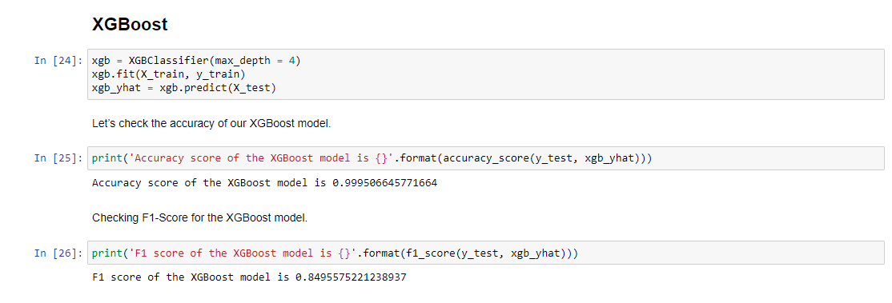

# Credit Card Fraud Detection Using Machine Learning & Python

We need for a system that can track the pattern of all the transactions and if any pattern is abnormal then the transaction should be aborted.

Today, we have many machine learning algorithms that can help us classify abnormal transactions. The only requirement is the past data and the suitable algorithm that can fit our data in a better form.

In this model, we will build a complete end-to-end model training process and finally, we will get the best model that can classify the transaction into normal and abnormal types.

## About the data

The data for this model can be found [**here**](https://www.kaggle.com/mlg-ulb/creditcardfraud). This dataset contains the real bank transactions made by European cardholders in the year 2013. As a security concern, the actual variables are not being shared but — they have been transformed versions of PCA. As a result, we can find 29 feature columns and 1 final class column.

## :camera: Screenshots

    

## Conclusion

Well, congratulation!! We just received 99.95% accuracy in our credit card fraud detection. This number should not be surprising as our data was balanced towards one class. The good thing that we have noticed from the confusion matrix is that — our model is not overfitted.

Finally, based on our accuracy score — XGBoost is the winner for our case. The only catch here is the data that we have received for model training. The data features are the transformed version of PCA. If the actual features follow a similar pattern then we are doing great!
